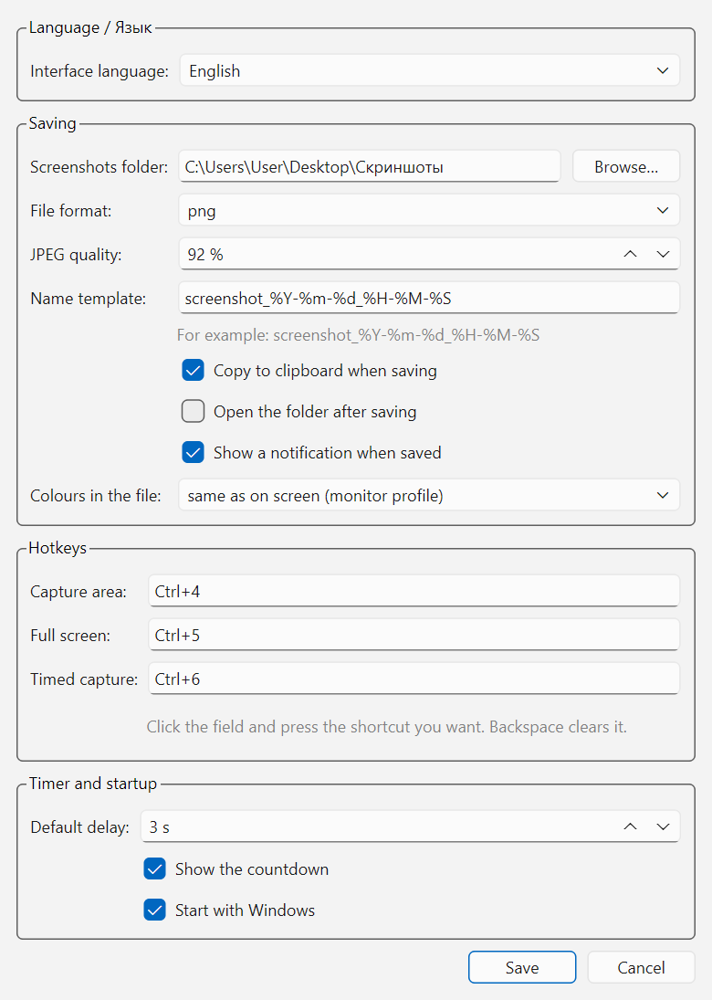

<div align="center">

# PyShot

**A fast screenshot tool for Windows — select an area, click a window, or set a timer, then annotate and save.**

Inspired by Lightshot's editor and the macOS Screenshot timer, written from scratch in Python + Qt.

[](https://github.com/Dimario-kurs/pyshot/actions/workflows/ci.yml)
[](https://www.python.org/)
[](https://doc.qt.io/qtforpython/)
[](#requirements)
[](LICENSE)

**English** · [Русский](README.ru.md)


</div>

---

## Contents

- [Why PyShot](#why-pyshot)
- [Features](#features)
- [Installation](#installation)
- [Quick start](#quick-start)
- [Capture modes](#capture-modes)
- [Editor](#editor)
- [Settings](#settings)
- [Colour accuracy](#colour-accuracy)
- [High-DPI and multi-monitor](#high-dpi-and-multi-monitor)
- [Building the executable](#building-the-executable)
- [Project layout](#project-layout)
- [Development](#development)
- [Limitations](#limitations)
- [License](#license)

---

## Why PyShot

Most screenshot tools either upload your screen to somebody's server or bury the
useful part behind an account. PyShot does neither: **nothing ever leaves your
machine** — no uploads, no sharing, no reverse image search, no telemetry, no
account. It lives in the system tray, answers a hotkey, and writes a PNG next to
you.

Two things it does that its inspirations do separately:

- **Lightshot-style editor** — pencil, line, arrow, rectangle, marker and text,
  right on top of the frozen screen.
- **macOS-style timer** — the frame you used last time comes back, you adjust it,
  press *Capture*, and the shot is taken a few seconds later **without touching
  the mouse**. That is the only way to photograph a menu or a tooltip that closes
  the moment you click somewhere else.

## Features

| | |
|---|---|
| **Area capture** | Freeze the screen, drag a rectangle, move it or resize it by eight handles, live pixel size readout. |
| **Window capture** | Hover a window — it lights up at full brightness with a blue outline — click to capture it whole. Real window bounds come from the DWM, without the invisible resize border. |
| **Full screen** | One hotkey, straight to a file. |
| **Timer** | Off / 3 / 5 / 10 seconds. The overlay disappears *before* the countdown, so the screen stays live and popups stay open. |
| **Annotations** | Pencil, line, arrow, rectangle, marker, text; 12-colour palette plus a colour picker; line width 1–20; undo/redo. |
| **Output** | PNG or JPEG with adjustable quality, `strftime` filename template, automatic de-duplication of names, clipboard copy, optional "open folder" and toast notification. |
| **Bilingual** | Russian and English, switched in Settings, applied to the tray menu immediately. |
| **Correct colours** | Saved files are tagged with the display's ICC profile, so a screenshot looks exactly like the screen it came from — see [Colour accuracy](#colour-accuracy). |
| **Full resolution** | On a 150 % display a 500 × 320 selection is saved as 750 × 480 real pixels. |
| **Global hotkeys** | Registered through the Win32 `RegisterHotKey` API, configurable by pressing the combination you want. |
| **Autostart** | A checkbox in Settings writes and removes the `HKCU\...\Run` entry — no digging through Task Manager. |

Everything is drawn in code: the tray icon, the toolbar icons and the application
`.ico` are generated by `QPainter`, so the repository ships no binary art assets.

## Installation

### Option A — install the released build (recommended)

Download the archive from [Releases](../../releases), unpack it and run
**`Установить PyShot.bat`**. Windows asks for administrator rights once, then
the installer:

- copies the program to **`C:\Program Files\PyShot`** — the standard location
  for installed software, protected by Windows, so it cannot be deleted by
  accident;
- adds a shortcut to the **Start menu** for every user of the computer;
- registers PyShot in **Settings → Apps → Installed apps**, so it uninstalls the
  usual way;
- removes an older per-user copy if one exists and keeps your "Start with
  Windows" preference pointing at the new location;
- starts the program as a normal, non-elevated process — silently, with no
  console window: the only sign of life is the tray icon.

Prefer a per-user installation without the UAC prompt? Run
`powershell -ExecutionPolicy Bypass -File tools\install.ps1 -PerUser` and the
program goes to `%LOCALAPPDATA%\Programs\PyShot` instead.

To remove it: *Settings → Apps → PyShot → Uninstall*. Your settings
(`%APPDATA%\PyShot`) and the screenshots you took are deliberately left alone.

### Option B — from source

```bash
git clone git@github.com:Dimario-kurs/pyshot.git
cd pyshot
python -m pip install -r requirements.txt
python main.py
```

On Windows use `pythonw main.py` (or `tools\run_from_source.bat`) to start it
without a console window.

### Requirements

- Windows 10 or 11 — global hotkeys and window enumeration use the Win32 API
- Python 3.10+ (developed and tested on 3.13)
- PySide6 6.6+ — the only dependency

## Quick start

1. Start PyShot. A blue frame icon appears in the notification area.
2. Press <kbd>Ctrl</kbd>+<kbd>4</kbd>. The screen dims and freezes.
3. Click a window, or drag a rectangle.
4. Draw on it if you want, then press <kbd>Enter</kbd> to save or
   <kbd>Ctrl</kbd>+<kbd>C</kbd> to copy.

Files land in **`Desktop\Скриншоты`** by default; the folder is created on first
run and can be changed in Settings.

### Default hotkeys

| Shortcut | Action |
|---|---|
| <kbd>Ctrl</kbd>+<kbd>4</kbd> | capture an area or a window |
| <kbd>Ctrl</kbd>+<kbd>5</kbd> | capture the whole screen |
| <kbd>Ctrl</kbd>+<kbd>6</kbd> | timed capture of the remembered frame |

All three are configurable — click the field in Settings and press the
combination you want. If Windows or another program already owns a combination,
PyShot says so in a notification instead of failing silently.

### Inside the capture window

| Key | Action |
|---|---|
| <kbd>Ctrl</kbd>+<kbd>A</kbd> | select the whole screen |
| <kbd>Enter</kbd> / <kbd>Ctrl</kbd>+<kbd>S</kbd> | save to the configured folder |
| <kbd>Ctrl</kbd>+<kbd>Shift</kbd>+<kbd>S</kbd> | save as… |
| <kbd>Ctrl</kbd>+<kbd>C</kbd> | copy to the clipboard |
| <kbd>Ctrl</kbd>+<kbd>Z</kbd> / <kbd>Ctrl</kbd>+<kbd>Y</kbd> | undo / redo a drawing |
| <kbd>Esc</kbd> or right-click | drop the tool → drop the selection → close |
| double-click | copy the selection |

## Capture modes

### Area and window


Move the mouse without pressing anything: the window under the cursor is shown at
full brightness with a blue outline and its size, everything else stays dimmed.
Click — the whole window is captured. Drag instead, and you get a free-form
rectangle. Overlapping windows are resolved by z-order, and the desktop
background is never offered as a "window".

### Timer


<kbd>Ctrl</kbd>+<kbd>6</kbd> brings back **the frame you used last time** — adjust
it, or draw a new one — and shows a small panel with the delay and a *Capture*
button. Press it and the overlay disappears at once; the countdown runs over the
live screen, so you can open a tray flyout, a context menu or a tooltip and keep
the mouse still. When the countdown ends, that rectangle is saved.

Set the timer to **off** and *Capture* fires immediately. The frame is stored in
the settings file and survives restarts.

## Editor

The toolbar mirrors Lightshot: pencil, line, arrow, rectangle, marker, text, a
colour swatch (which also hides the line-width slider) and undo. The bottom panel
keeps only what is needed — copy, save, close.

Text is typed directly on the screenshot; the marker is a translucent chisel
stroke; arrow heads scale with the line width. Annotations are rendered into the
final image at full device resolution, not at the on-screen size.

## Settings

Tray → **Settings…**



| Group | What is inside |
|---|---|
| Language | Russian / English, applied to the tray menu immediately |
| Saving | folder, PNG/JPEG + quality, filename template, clipboard copy, open folder, notifications, colour profile |
| Hotkeys | three fields that record the combination you press; <kbd>Backspace</kbd> clears one |
| Timer and startup | default delay, countdown visibility, "Start with Windows" |

Settings live in `%APPDATA%\PyShot\config.json` — plain JSON, safe to edit by hand
or to delete for a clean start.

## Colour accuracy

A screenshot that looks duller than the screen it came from is a classic
complaint, and it is not the capture's fault. PyShot reads pixels exactly:
`#ff0000` on screen is `#ff0000` in the file, verified by the test suite.

The difference appears **when the image is displayed**. The desktop is drawn
without colour management, while viewers such as Photos or Chrome convert images
into the monitor's ICC profile. On a wide-gamut or HDR-calibrated display, that
conversion visibly changes an untagged screenshot.

So PyShot tags saved files with the **display's own ICC profile** — exactly what
macOS does. The viewer's conversion becomes an identity transform and the file
matches the screen. If you share screenshots with other people, switch
*Colours in the file* to **sRGB**; **none** reproduces the old untagged
behaviour. Pixels are never rewritten, only the tag changes.

## High-DPI and multi-monitor

Every screen is grabbed separately and composed into one virtual-desktop image at
the highest device pixel ratio present, so a selection on a 150 % display is saved
at 150 % — a 500 × 320 rectangle becomes a 750 × 480 file. Monitors of different
sizes and scale factors are stitched by their real geometry, and a selection may
cross the boundary between them.

## Building the executable

```bash
tools\build_exe.bat
```

or manually:

```bash
python -m pip install pyinstaller
python tools/make_ico.py
python -m PyInstaller --noconfirm --clean --noconsole --onefile --name PyShot --icon assets/PyShot.ico main.py
```

The result is `dist/PyShot.exe`, roughly 46 MB, self-contained. The application
icon is generated by `tools/make_ico.py`, which packs eight sizes (16 – 256 px)
into a proper multi-resolution `.ico`. Every push to `main` builds the same
executable on GitHub Actions and uploads it as an artifact.

## Project layout

```
main.py                    entry point, single-instance lock
pyshot/
├── app.py                 tray icon, menu, hotkey routing, capture flows
├── capture.py             grabbing all screens into one image
├── overlay.py             the frozen full-screen window: selection and drawing
├── panels.py              toolbars, generated icons, colour and timer popups
├── shapes.py              annotation primitives and their rendering
├── storage.py             saving, clipboard, ICC profile tagging
├── winlist.py             window rectangles for the hover highlight
├── countdown.py           the timer widget
├── settings_dialog.py     settings window
├── hotkeys.py             global hotkeys via RegisterHotKey + native event filter
├── config.py              JSON settings, autostart registry entry
└── i18n.py                Russian and English interface strings
Установить PyShot.bat       per-user installer entry point
tools/
├── install.ps1            install to Program Files (or --PerUser), shortcut,
│                          uninstall entry, migration of an older copy
├── uninstall.ps1          removes everything except your settings and shots
├── build_exe.bat          one-click PyInstaller build
├── make_ico.py            generates the multi-size application icon
├── make_docs_images.py    regenerates the screenshots in docs/
└── run_from_source.bat    launches main.py without a console
tests/                     offscreen test suite
```

## Development

```bash
python -m pip install -r requirements.txt
python tests/test_pyshot.py      # offscreen, ~40 checks, no windows appear
python tools/make_docs_images.py # regenerate the screenshots in docs/
```

The suite covers hotkey parsing, icon generation, selection geometry and panel
placement, window hit-testing, export at 1× and 1.5× scale, file saving with all
three colour-profile modes, translation coverage, and the remembered-region timer
flow. It redirects `%APPDATA%` to a temporary directory, so running it never
touches your real configuration.

Adding a third language means adding one dictionary to `pyshot/i18n.py`; the
Russian strings in the source double as translation keys.

## Limitations

- **Windows only.** Global hotkeys, window enumeration and the autostart entry
  use the Win32 API. The rest of the code is portable Qt.
- **HDR content** is captured through the SDR pipeline, like every GDI-based
  tool: highlights beyond SDR white are clipped.
- **Elevated windows** (Task Manager, UAC prompts) are not covered by a
  non-elevated process — the overlay cannot draw on top of them.
- No uploading, no sharing, no OCR — by design.

## License

[MIT](LICENSE) © 2026 Dimario-kurs
