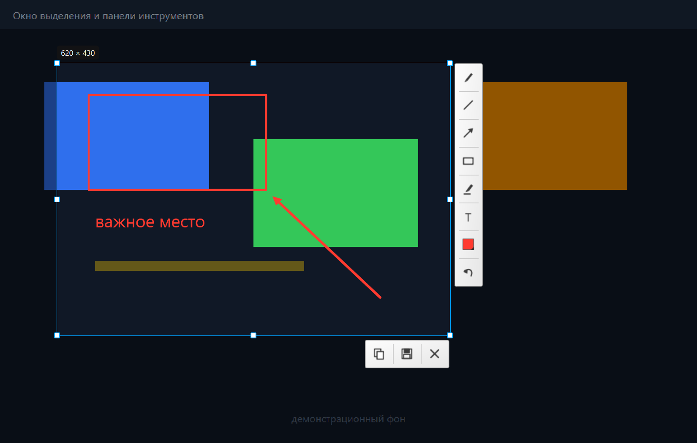
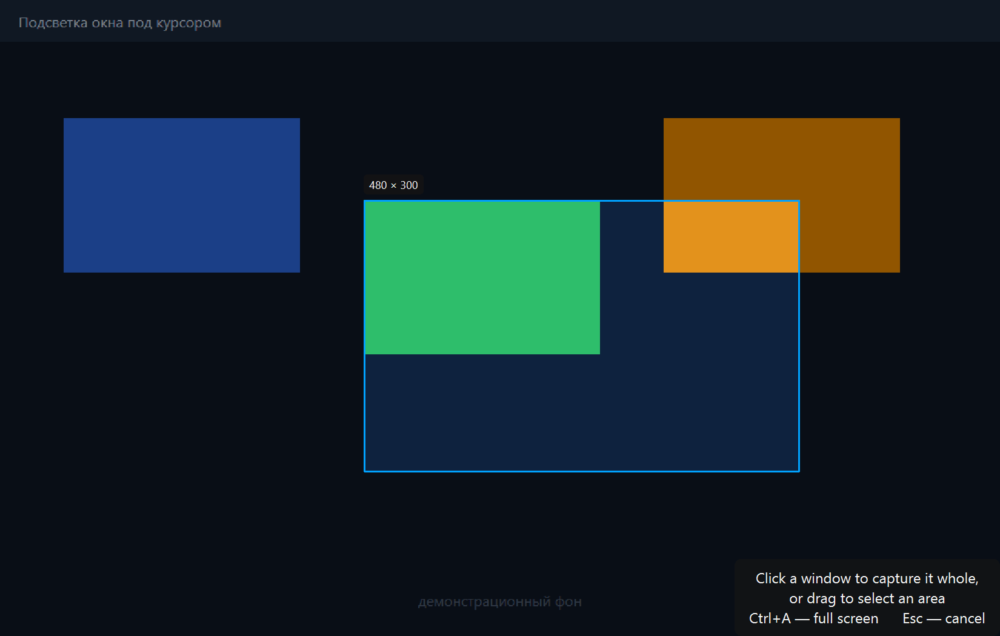
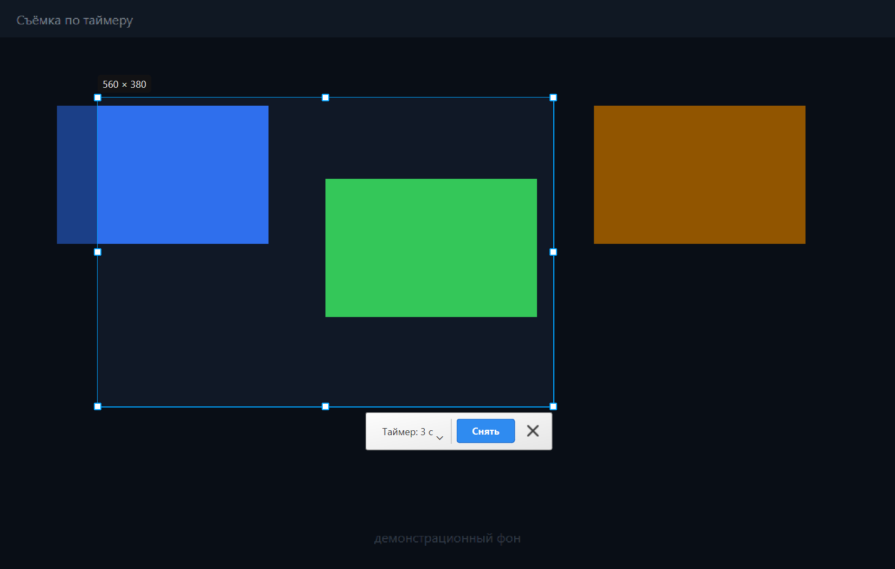
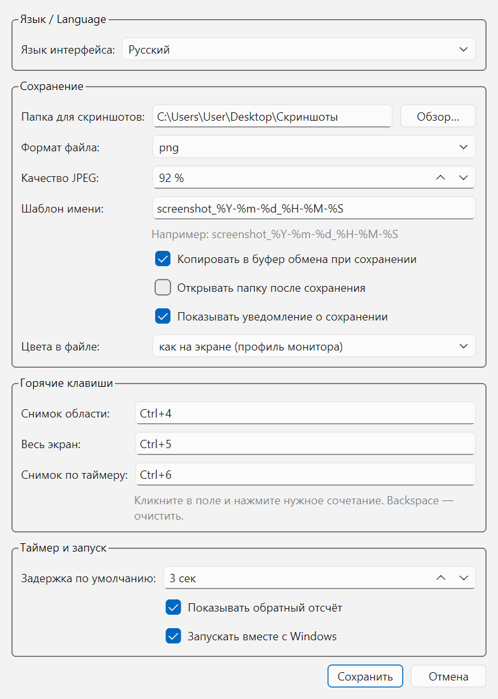

<div align="center">

# PyShot

**Скриншотер для Windows: снимок области, окна по клику или по таймеру — с разметкой и сохранением.**

Редактор сделан по образцу Lightshot, таймер — по образцу штатного «Снимка экрана» на macOS. Написан с нуля на Python и Qt.

[](https://github.com/Dimario-kurs/pyshot/actions/workflows/ci.yml)
[](https://www.python.org/)
[](https://doc.qt.io/qtforpython/)
[](#требования)
[](LICENSE)

[English](README.md) · **Русский**



</div>

---

## Содержание

- [Зачем](#зачем)
- [Возможности](#возможности)
- [Установка](#установка)
- [Быстрый старт](#быстрый-старт)
- [Режимы съёмки](#режимы-съёмки)
- [Редактор](#редактор)
- [Настройки](#настройки)
- [Цвета как на экране](#цвета-как-на-экране)
- [HiDPI и несколько мониторов](#hidpi-и-несколько-мониторов)
- [Сборка exe](#сборка-exe)
- [Структура проекта](#структура-проекта)
- [Разработка](#разработка)
- [Ограничения](#ограничения)
- [Лицензия](#лицензия)

---

## Зачем

Большинство скриншотеров либо заливают ваш экран на чей-то сервер, либо прячут
нужное за регистрацией. Здесь нет ни того, ни другого: **ничего не уходит с
компьютера** — ни загрузки на хостинг, ни «поделиться», ни поиска картинки в
интернете, ни телеметрии, ни аккаунта. Программа живёт в трее, отзывается на
горячую клавишу и кладёт PNG в вашу папку.

Две вещи, которые у прародителей сделаны порознь:

- **Редактор в стиле Lightshot** — карандаш, линия, стрелка, прямоугольник,
  маркер и текст прямо поверх замороженного экрана.
- **Таймер в стиле macOS** — возвращается рамка, которой вы пользовались в
  прошлый раз; вы её поправляете, жмёте «Снять», и снимок делается через
  несколько секунд **без участия мыши**. Иначе не сфотографировать меню или
  подсказку, которые закрываются от щелчка мимо.

## Возможности

| | |
|---|---|
| **Снимок области** | Экран замирает, тянете рамку мышью, двигаете её и растягиваете за восемь маркеров, размер в пикселях виден сразу. |
| **Снимок окна** | Наводите курсор — окно подсвечивается в полную яркость с синей рамкой — клик снимает его целиком. Границы берутся у DWM, без невидимых полей изменения размера. |
| **Весь экран** | Одна клавиша — файл готов. |
| **Таймер** | Нет / 3 / 5 / 10 секунд. Окно выделения исчезает **до** начала отсчёта, поэтому экран остаётся живым и всплывающие окна не закрываются. |
| **Разметка** | Карандаш, линия, стрелка, прямоугольник, маркер, текст; палитра из 12 цветов плюс выбор любого; толщина 1–20; отмена и возврат. |
| **Сохранение** | PNG или JPEG с настраиваемым качеством, шаблон имени в стиле `strftime`, автоматическая нумерация совпадений, копия в буфер, по желанию — открыть папку и показать уведомление. |
| **Два языка** | Русский и английский, переключаются в настройках, меню в трее меняется сразу. |
| **Верные цвета** | Файл помечается ICC-профилем монитора, поэтому снимок выглядит ровно как экран — подробности в разделе [Цвета как на экране](#цвета-как-на-экране). |
| **Полное разрешение** | При масштабе 150 % выделение 500 × 320 сохраняется как 750 × 480 настоящих пикселей. |
| **Глобальные клавиши** | Через WinAPI `RegisterHotKey`, назначаются нажатием нужного сочетания. |
| **Автозапуск** | Галочка в настройках сама пишет и убирает запись в `HKCU\...\Run` — в автозагрузку лезть не нужно. |

Вся графика рисуется кодом: значок в трее, иконки инструментов и `.ico` для exe
создаются через `QPainter`, в репозитории нет ни одной картинки-заготовки.

## Установка

### Вариант А — установка готовой сборки (рекомендуется)

Скачайте архив из раздела [Releases](../../releases), распакуйте и запустите
**`Установить PyShot.bat`**. Windows один раз спросит права администратора,
после чего установщик:

- копирует программу в **`C:\Program Files\PyShot`** — стандартное место для
  установленных программ; папку защищает система, случайно её не снести;
- добавляет ярлык в меню **«Пуск»** для всех пользователей компьютера;
- регистрирует PyShot в **Параметрах → Приложения**, чтобы удалялся он штатно;
- убирает прежнюю копию из профиля пользователя, если она была, и переносит
  на новое место галочку «Запускать вместе с Windows»;
- запускает программу обычным процессом, без прав администратора, тихо и без
  окна консоли: единственный признак работы — значок в области уведомлений.

Нужна установка только для себя, без запроса UAC? Запустите
`powershell -ExecutionPolicy Bypass -File tools\install.ps1 -PerUser` —
программа встанет в `%LOCALAPPDATA%\Programs\PyShot`.

Удаление: *Параметры → Приложения → PyShot → Удалить*. Настройки
(`%APPDATA%\PyShot`) и сами скриншоты при этом намеренно остаются на месте.

### Вариант Б — из исходников

```bash
git clone git@github.com:Dimario-kurs/pyshot.git
cd pyshot
python -m pip install -r requirements.txt
python main.py
```

Чтобы окно консоли не появлялось, запускайте через `pythonw main.py` или
двойным кликом по `tools\run_from_source.bat`.

### Требования

- Windows 10 или 11 — горячие клавиши и список окон работают через WinAPI
- Python 3.10+ (разрабатывалось и проверялось на 3.13)
- PySide6 6.6+ — единственная зависимость

## Быстрый старт

1. Запустите PyShot. В области уведомлений появится синий значок-рамка.
2. Нажмите <kbd>Ctrl</kbd>+<kbd>4</kbd>. Экран потемнеет и замрёт.
3. Кликните по окну или протяните рамку мышью.
4. При желании порисуйте поверх, затем <kbd>Enter</kbd> — сохранить,
   <kbd>Ctrl</kbd>+<kbd>C</kbd> — скопировать.

По умолчанию файлы ложатся в **`Рабочий стол\Скриншоты`**; папка создаётся при
первом запуске и меняется в настройках.

### Горячие клавиши по умолчанию

| Сочетание | Действие |
|---|---|
| <kbd>Ctrl</kbd>+<kbd>4</kbd> | снимок области или окна |
| <kbd>Ctrl</kbd>+<kbd>5</kbd> | весь экран |
| <kbd>Ctrl</kbd>+<kbd>6</kbd> | снимок запомненной рамки по таймеру |

Все три меняются: кликните в поле настроек и нажмите нужное сочетание. Если
клавиши уже заняты Windows или другой программой, PyShot скажет об этом
уведомлением, а не промолчит.

### Клавиши в окне выделения

| Клавиши | Действие |
|---|---|
| <kbd>Ctrl</kbd>+<kbd>A</kbd> | выделить весь экран |
| <kbd>Enter</kbd> / <kbd>Ctrl</kbd>+<kbd>S</kbd> | сохранить в папку из настроек |
| <kbd>Ctrl</kbd>+<kbd>Shift</kbd>+<kbd>S</kbd> | сохранить как… |
| <kbd>Ctrl</kbd>+<kbd>C</kbd> | копировать в буфер обмена |
| <kbd>Ctrl</kbd>+<kbd>Z</kbd> / <kbd>Ctrl</kbd>+<kbd>Y</kbd> | отменить / вернуть рисование |
| <kbd>Esc</kbd> или правая кнопка | сбросить инструмент → выделение → выход |
| двойной клик | копировать выделенное |

## Режимы съёмки

### Область и окно



Просто ведите мышь, ничего не нажимая: окно под курсором показывается в полную
яркость с синей рамкой и размером, остальное остаётся затемнённым. Клик — снято
всё окно. Протянули мышь — получили произвольную область. Перекрытые окна
разбираются по слоям, фон рабочего стола за «окно» не считается.

### Таймер



<kbd>Ctrl</kbd>+<kbd>6</kbd> возвращает **рамку с прошлого раза** — поправьте её
или нарисуйте новую — и показывает панель с задержкой и кнопкой «Снять». Жмёте —
окно выделения исчезает сразу, а отсчёт идёт уже по живому экрану: можно открыть
меню трея, контекстное меню или подсказку и не трогать мышь. По нулям этот
прямоугольник сохраняется.

Поставьте таймер в положение **нет** — «Снять» сработает мгновенно. Рамка
хранится в настройках и переживает перезапуск.

## Редактор

Панель повторяет Lightshot: карандаш, линия, стрелка, прямоугольник, маркер,
текст, квадрат цвета (в нём же ползунок толщины) и отмена. Снизу только нужное —
копировать, сохранить, закрыть.

Текст набирается прямо на скриншоте, маркер — полупрозрачный широкий штрих,
наконечники стрелок растут вместе с толщиной линии. Разметка отрисовывается в
итоговый файл в полном разрешении, а не в экранном.

## Настройки

Трей → **Настройки…**



| Раздел | Что внутри |
|---|---|
| Язык | русский или английский, меню в трее меняется сразу |
| Сохранение | папка, PNG/JPEG и качество, шаблон имени, копия в буфер, открывать папку, уведомления, цветовой профиль |
| Горячие клавиши | три поля, запоминающие нажатое сочетание; <kbd>Backspace</kbd> очищает |
| Таймер и запуск | задержка по умолчанию, показ отсчёта, «Запускать вместе с Windows» |

Настройки лежат в `%APPDATA%\PyShot\config.json` — обычный JSON, его можно
править руками или удалить, чтобы начать с чистого листа.

## Цвета как на экране

Жалоба «снимок бледнее, чем экран» — классическая, и захват тут ни при чём.
PyShot читает пиксели точь-в-точь: `#ff0000` на экране даёт `#ff0000` в файле,
это проверяется тестами.

Разница появляется **при показе**. Рабочий стол рисуется без управления цветом,
а «Фотографии» или Chrome пересчитывают картинку под ICC-профиль монитора. На
широком охвате или при HDR-калибровке такой пересчёт заметно меняет непомеченный
снимок.

Поэтому файл помечается **профилем самого монитора** — ровно так поступает
macOS. Пересчёт становится тождественным, и файл совпадает с экраном. Если
скриншоты уходят другим людям, переключите *Цвета в файле* на **sRGB**; вариант
**не указывать** возвращает прежнее поведение. Пиксели при этом не переписываются
— меняется только метка.

## HiDPI и несколько мониторов

Каждый экран снимается отдельно и собирается в одно изображение виртуального
рабочего стола по наибольшему масштабу, поэтому выделение на экране со 150 %
сохраняется в 150 %: прямоугольник 500 × 320 даёт файл 750 × 480. Мониторы разных
размеров и с разным масштабом сшиваются по реальной геометрии, а выделение может
пересекать границу между ними.

## Сборка exe

```bash
tools\build_exe.bat
```

или вручную:

```bash
python -m pip install pyinstaller
python tools/make_ico.py
python -m PyInstaller --noconfirm --clean --noconsole --onefile --name PyShot --icon assets/PyShot.ico main.py
```

На выходе `dist/PyShot.exe` — около 46 МБ, самодостаточный. Иконку собирает
`tools/make_ico.py`: он упаковывает восемь размеров (16 – 256 px) в настоящий
многоразмерный `.ico`. Тот же exe собирается на GitHub Actions при каждом
пуше в `main` и выкладывается артефактом.

## Структура проекта

```
main.py                    точка входа, защита от второй копии
pyshot/
├── app.py                 значок в трее, меню, горячие клавиши, сценарии съёмки
├── capture.py             снимок всех экранов в одно изображение
├── overlay.py             замороженное окно на весь экран: выделение и рисование
├── panels.py              панели, иконки, всплывающие палитра и таймер
├── shapes.py              фигуры разметки и их отрисовка
├── storage.py             сохранение, буфер обмена, метка ICC-профиля
├── winlist.py             прямоугольники окон для подсветки под курсором
├── countdown.py           окно обратного отсчёта
├── settings_dialog.py     окно настроек
├── hotkeys.py             глобальные клавиши через RegisterHotKey
├── config.py              настройки в JSON, запись автозапуска
└── i18n.py                русские и английские тексты интерфейса
Установить PyShot.bat       установщик для текущего пользователя
tools/
├── install.ps1            установка в Program Files (или -PerUser), ярлык,
│                          запись об удалении, перенос прежней копии
├── uninstall.ps1          удаление всего, кроме настроек и снимков
├── build_exe.bat          сборка exe одной командой
├── make_ico.py            генератор многоразмерной иконки приложения
├── make_docs_images.py    пересборка картинок в docs/
└── run_from_source.bat    запуск main.py без консоли
tests/                     тесты без графической оболочки
```

## Разработка

```bash
python -m pip install -r requirements.txt
python tests/test_pyshot.py      # offscreen, ~40 проверок, окна не появляются
python tools/make_docs_images.py # пересобрать картинки в docs/
```

Тесты покрывают разбор горячих клавиш, генерацию иконок, геометрию выделения и
раскладку панелей, попадание по окнам, экспорт при масштабе 1× и 1.5×,
сохранение файлов во всех трёх режимах цветового профиля, полноту перевода и
сценарий таймера с запомненной областью. `%APPDATA%` подменяется на временную
папку, так что запуск тестов не трогает ваши настройки.

Чтобы добавить третий язык, достаточно дописать ещё один словарь в
`pyshot/i18n.py`: русские строки в коде служат ключами перевода.

## Ограничения

- **Только Windows.** Горячие клавиши, список окон и автозапуск используют
  WinAPI. Остальной код — переносимый Qt.
- **HDR-контент** снимается через SDR-конвейер, как и любым инструментом на GDI:
  яркость выше белого SDR обрезается.
- **Окна с правами администратора** (диспетчер задач, запросы UAC) не
  перекрываются обычным процессом — оверлей поверх них не рисуется.
- Ни загрузки в интернет, ни «поделиться», ни распознавания текста — намеренно.

## Лицензия

[MIT](LICENSE) © 2026 Dimario-kurs
